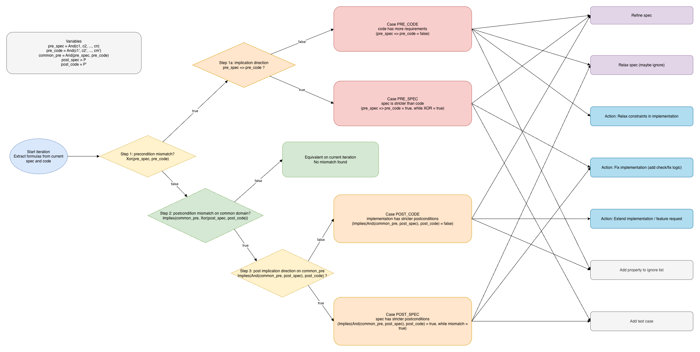

# Dualify

Dualify is a research framework for bidirectional verification:

1. Spec-to-Logic (LLM extracts formal logic from informal specs)
2. Code-to-Logic (LLM extracts formal logic from implementation)
3. SMT-Checking (Z3 compares formulas and finds counterexamples)
4. Refinement (LLM suggests spec/code improvements from mismatches)

## Pipeline overview



## Quick start

1. Install all dependencies and checks (includes Ollama install/start check and model pull):

   ```bash
   ./setup.sh
   ```

   Optional model override:

   ```bash
   DUALIFY_MODEL=qwen2.5:3b-instruct ./setup.sh
   ```

2. Run full experiment:

   ```bash
   poetry run python scripts/run_experiment.py --model qwen2.5:3b-instruct --benchmark synthetic
   ```

3. Run mismatch demo benchmark (intentionally inconsistent specs):

   ```bash
   poetry run python scripts/run_experiment.py --model qwen2.5:3b-instruct --benchmark mismatch
   ```

## Benchmark input format (no JSON required)

- Put Python files into `benchmark/synthetic/`.
- Add a short natural-language description in comments directly above each function.
- Add optional `Context:` comment lines above the function for assumptions/preconditions.
- Keep explicit type annotations (`int`/`bool`) in function signature.

Example:

```python
# Return True when x is positive.
def is_positive(x: int) -> bool: ...
```

## Output artifacts

- Single run report per launch:
  - `results/<benchmark>_<yyyy_mm_dd_hh_mm_ss>.json`

## Development quality checks

- Lint: `poetry run ruff check .`
- Format: `poetry run ruff format .`
- Type-check: `poetry run mypy`
- Tests: `poetry run pytest`
- Install git hooks: `poetry run pre-commit install`

CI runs the same checks on push/PR via `.github/workflows/ci.yml`.

