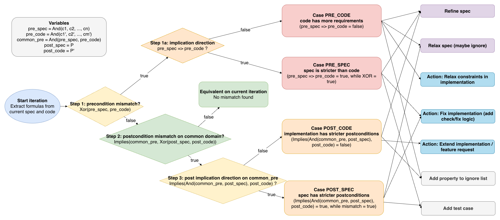

# Dualify

Dualify is a research framework for bidirectional verification:

1. Spec-to-Logic (LLM extracts formal logic from informal specs)
2. Code-to-Logic (LLM extracts formal logic from implementation)
3. SMT-Checking (Z3 compares formulas and finds counterexamples)
4. Refinement (LLM suggests spec/code improvements from mismatches)

## Pipeline overview



## Quick start

1. Install all dependencies and checks (includes Ollama install/start check and model pull):

   ```bash
   ./setup.sh
   ```

   Optional model override:

   ```bash
   DUALIFY_MODEL=qwen2.5:3b-instruct ./setup.sh
   ```

2. Run full experiment:

   ```bash
   poetry run python scripts/run_experiment.py --model qwen2.5:3b-instruct --benchmark synthetic
   ```

   Run against OpenAI-compatible API (e.g. vLLM `/v1/completions`):

   ```bash
   poetry run dualify-run \
     --provider openai \
     --base-url http://10.100.30.241:8800 \
     --api-key API_KEY \
     --model Qwen/Qwen3-Coder-Next-FP8 \
     --benchmark synthetic
   ```

3. Run mismatch demo benchmark (intentionally inconsistent specs):

   ```bash
   poetry run python scripts/run_experiment.py --model qwen2.5:3b-instruct --benchmark mismatch
   ```

4. Scan a real Python repository (iterative inconsistency search):

   ```bash
   poetry run dualify-run --model qwen2.5:3b-instruct --repo-path ./path/to/repo --iterations 2
   ```

   - Interactive mode (default): for each function, Dualify shows SMT comparison,
     asks you to choose an action (p04), then executes selected action prompt (p05).
   - Non-interactive mode:

   ```bash
   poetry run dualify-run --model qwen2.5:3b-instruct \
     --repo-path ./path/to/repo --iterations 2 --non-interactive
   ```

## Record, replay, and resume LLM calls

Every run hits an LLM. That makes runs slow, costly, and non-deterministic
across model versions. Dualify can wrap the live LLM client so each call is
written to a JSONL transcript on disk; later runs can replay that transcript
instead of calling the API. Useful for:

- **Artifact reproducibility** — commit a transcript, anyone can re-derive
  the report without an API key.
- **Offline CI** — drive the full pipeline from a fixed transcript.
- **Bisecting** — tweak the code, replay the same transcript, see exactly
  which case flipped.

Three flags, mutually exclusive:

| Flag | What it does |
|---|---|
| `--record-transcript PATH` | Run live; append every call to `PATH` (truncates if it exists). |
| `--replay PATH` | Serve responses from `PATH`; no live LLM, no API key needed. |
| `--resume-transcript PATH` | Serve cached prefix from `PATH`, fall through to the live LLM for any remaining calls, and append the new ones to the same file. Use this to continue after an interrupted recording. |

### Worked example: record, interrupt, resume

```bash
# Initial recording -- run against the live API.
poetry run dualify-run \
  --repo-path ./repos/python-barcode --non-interactive \
  --record-transcript transcripts/barcode.jsonl
# ... ctrl-C halfway through.

# Resume -- replays what's already in the file, calls the live LLM for the rest.
poetry run dualify-run \
  --repo-path ./repos/python-barcode --non-interactive \
  --resume-transcript transcripts/barcode.jsonl

# Once complete, anyone can re-derive the report offline:
poetry run dualify-run \
  --repo-path ./repos/python-barcode --non-interactive \
  --replay transcripts/barcode.jsonl
```

Transcripts are line-buffered, so each record is on disk the moment its
call returns — safe to `tail -f` and safe to resume even after a hard kill.

### Drift detection

Every record carries the SHA-256 of its prompt. On `--replay` and on the
cached prefix of `--resume-transcript`:

- **`TranscriptPromptMismatchError`** — a prompt template changed since
  the transcript was recorded. Re-record.
- **`TranscriptExhaustedError`** (replay only) — the current code path
  issues more LLM calls than the transcript holds (e.g. you widened the
  case filter). Re-record, or narrow the input back to the recorded scope.

Both errors fire at the exact call that drifted, never silently.

## Benchmark input format (no JSON required)

- Put Python files into `benchmark/synthetic/`.
- Add a short natural-language description in comments directly above each function.
- Add optional `Context:` comment lines above the function for assumptions/preconditions.
- Keep explicit type annotations (`int`/`bool`) in function signature.

Example:

```python
# Return True when x is positive.
def is_positive(x: int) -> bool: ...
```

## Output artifacts

- Single run report per launch:
  - `results/<benchmark>_<yyyy_mm_dd_hh_mm_ss>.json`

## Development quality checks

- Lint: `poetry run ruff check .`
- Format: `poetry run ruff format .`
- Type-check: `poetry run mypy`
- Tests: `poetry run pytest`
- Install git hooks: `poetry run pre-commit install`

CI runs the same checks on push/PR via `.github/workflows/ci.yml`.
