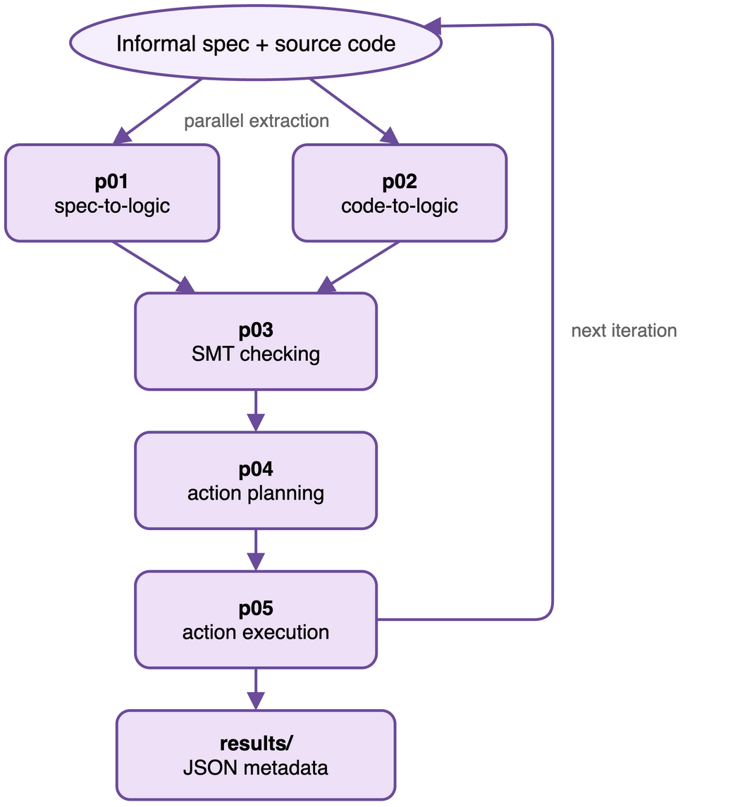

# Dualify

Bidirectional formal synchronization between **informal specification** and **source code**.
Dualify lifts each channel independently into SMT-checkable pre/post formulas, uses Z3 to
arbitrate agreement, maps every mismatch to a named case with a **closed action menu**, and
persists formulas, witnesses, and verdicts as durable per-function metadata.


## Pipeline

Parallel extraction from spec and code, deterministic SMT checking, then optional
refinement planning and execution:



| Phase | Module | Role |
|---|---|---|
| **p01** | `spec_to_logic` | LLM extracts pre/post from informal spec |
| **p02** | `code_to_logic` | LLM extracts pre/post from implementation |
| **p03** | `smt_checking` | Z3 equivalence + witness; five SMT cases + low-confidence sink |
| **p04** | `action_planning` | Map SMT reason → triggered case → baseline actions |
| **p05** | `action_execution` | Run selected action (fix plan, test suggestion, …) |

## Action matrix (SMT cases → actions)

After p03, every non-equivalent outcome maps to one named case. Each case exposes a
**fixed subset** of the action catalog (the LLM planner may reorder or subset, not invent):


| Case | Meaning (informal) | Typical baseline actions |
|---|---|---|
| `PRE_CODE` | Code requires stricter inputs than spec | `refine_spec`, `relax_constraints_in_implementation`, … |
| `PRE_SPEC` | Spec promises inputs code does not enforce | `fix_implementation`, `refine_spec`, … |
| `POST_CODE` | Code post is stronger than spec on shared domain | `refine_spec`, `fix_implementation`, … |
| `POST_SPEC` | Spec post is stronger than code | `fix_implementation`, `add_test_case`, … |
| `EQUIVALENT` | Spec and code agree on common domain | (none — iteration can stop) |
| `LOW_CONFIDENCE_PARSE` / `SOLVER_UNKNOWN` | Degraded extraction or Z3 `unknown` | `investigate_instrumentation`, … |

Implementation: `src/dualify/phases/p04_action_planning.py` (`_resolve_case_and_actions`).

## Repository layout

```
benchmark/
  lifted/                 # Gold oracle: 40 human-confirmed YAML contracts
  lifted_auto_eval/       # Gold campaign input: 40 correct .py snippets (RQ1–RQ3, RQ5)
  lifted_inconsistency/   # Inconsistency fork: 10 buggy / 30 correct (RQ4 only)
  dataset/                # Source corpus (python-by-contract, CrossHair)
  synthetic/              # Small toy benchmarks for smoke tests
src/dualify/              # Pipeline, gold scoring, runner, transcripts
scripts/                  # Campaigns, baselines, ablation, reproducibility
docs/figures/             # Pipeline and action-matrix diagrams (also in paper)
case_studies/             # Operator-as-orchestrator case study artifacts
results/                  # Run reports (gitignored except expert-review bundle)
```

## Quick start

```bash
./setup.sh
```

Optional model override: `DUALIFY_MODEL=qwen2.5:3b-instruct ./setup.sh`

### Smoke test (synthetic benchmark)

```bash
poetry run python scripts/run_experiment.py \
  --model qwen2.5:3b-instruct --benchmark synthetic
```

### OpenAI-compatible API (e.g. vLLM)

```bash
poetry run dualify-run \
  --provider openai \
  --base-url http://HOST:8802 \
  --api-key "$DUALIFY_API_KEY" \
  --model "Qwen/Qwen3-Coder-Next-FP8" \
  --benchmark synthetic
```

### Scan a real repository (operator loop)

```bash
poetry run dualify-run \
  --provider openai --base-url http://HOST:8802 --api-key "$DUALIFY_API_KEY" \
  --model "Qwen/Qwen3-Coder-Next-FP8" \
  --repo-path ./path/to/repo --iterations 2
```

Interactive mode (default) prints the SMT report and prompts for an action from the
closed menu. Non-interactive: add `--non-interactive`.

## Benchmark suites (forked by experiment)

Each experiment type uses its **own input directory** so metrics are not confounded.

| Experiment | Input | Oracle / labels | Docs |
|---|---|---|---|
| RQ1 cross-check (no gold) | `benchmark/lifted_auto_eval/` | — | below |
| RQ2 gold fidelity | same + `benchmark/lifted/` YAML | human reference contracts | [`benchmark/lifted/README.md`](benchmark/lifted/README.md) |
| RQ3 stability / replay | same | frozen transcripts | below |
| RQ5 single-channel ablation | same | gold + cross-check | `scripts/analyze_ablation.py` |
| **RQ4 inconsistency baseline** | **`benchmark/lifted_inconsistency/`** | **`manifest.json`** | [`benchmark/lifted_inconsistency/README.md`](benchmark/lifted_inconsistency/README.md) |

**Gold release (40 cases):** all **correct** implementations with human-confirmed
in-fragment reference contracts. Bug-injected cases live only in the RQ4 fork
(10 faulty / 30 correct), not in the gold oracle set.

Regenerate the inconsistency fork after editing case lists:

```bash
poetry run python scripts/build_inconsistency_benchmark.py
```

## Multi-run campaigns

Seven-run gold campaign (records one frozen transcript per run):

```bash
poetry run python scripts/run_campaign.py \
  --provider openai --base-url http://HOST:8802 --api-key "$DUALIFY_API_KEY" \
  --model "Qwen/Qwen3-Coder-Next-FP8" \
  --benchmark lifted_auto_eval --runs 7 --label qwen_local
```

Output: `results/campaigns/<benchmark>__<label>/run_NN/` + `aggregate.json`.

### RQ4: LLM-as-judge baseline + Dualify cross-check

```bash
# Dualify arm (cross-check transcripts)
poetry run python scripts/run_campaign.py \
  --provider openai --base-url http://HOST:8802 --api-key "$DUALIFY_API_KEY" \
  --model "Qwen/Qwen3-Coder-Next-FP8" \
  --benchmark lifted_inconsistency --runs 7 --label qwen_local

# No-SMT judge baseline (uses manifest.json labels)
poetry run python scripts/run_baseline_judge.py \
  --provider openai --base-url http://HOST:8802 --api-key "$DUALIFY_API_KEY" \
  --model "Qwen/Qwen3-Coder-Next-FP8" \
  --benchmark lifted_inconsistency --runs 7 --label qwen_local \
  --dualify-campaign results/campaigns/lifted_inconsistency__qwen_local
```

### Offline reproducibility (reviewers, no API key)

SMT and parser stages call no model — verdicts are a pure function of recorded LLM output:

```bash
poetry run python scripts/verify_reproducibility.py \
  results/campaigns/lifted_auto_eval__qwen_local
```

Replays every run transcript twice and asserts byte-stable verdict vectors.

### Ablation (offline, from existing campaign)

```bash
poetry run python scripts/analyze_ablation.py \
  results/campaigns/lifted_auto_eval__qwen_local
```

Writes `ablation.json`: spec-only vs code-only vs dual cross-check (no new LLM calls).

## Record, replay, and resume LLM calls

| Flag | Behavior |
|---|---|
| `--record-transcript PATH` | Live run; append each LLM call to `PATH` |
| `--replay PATH` | Serve from transcript only; zero API calls |
| `--resume-transcript PATH` | Replay cached prefix, live LLM for remainder, append to same file |

```bash
poetry run dualify-run --repo-path ./repos/example --non-interactive \
  --record-transcript transcripts/example.jsonl
# interrupted …
poetry run dualify-run --repo-path ./repos/example --non-interactive \
  --resume-transcript transcripts/example.jsonl
# finished — anyone can replay:
poetry run dualify-run --repo-path ./repos/example --non-interactive \
  --replay transcripts/example.jsonl
```

Drift detection: `TranscriptPromptMismatchError` (prompt template changed) and
`TranscriptExhaustedError` (replay scope wider than transcript) fail at the exact
offending call.

## Benchmark input format (synthetic / custom)

For `benchmark/synthetic/` and ad-hoc scans:

- One Python file per function (or repo discovery).
- Natural-language spec in comments above the function.
- Optional `Context:` comment lines for assumptions.
- Explicit type annotations in the signature.

```python
# Return True when x is positive.
def is_positive(x: int) -> bool: ...
```

## Output artifacts

Each run writes JSON under `results/` with per-case:

- `spec_to_logic` / `code_to_logic` extractions
- `smt_checking` verdict, reason, counterexample
- `gold_scoring` (when gold YAML exists for the case)
- `fingerprint` — content hash for staleness checks (`dualify.fingerprint`)

Rescore gold without LLM calls:

```bash
poetry run python -m dualify.runner --score-gold-json results/lifted_auto_eval_*.json
```

## Scripts reference

| Script | Purpose |
|---|---|
| `scripts/run_experiment.py` | Single benchmark run (synthetic, mismatch, …) |
| `scripts/run_campaign.py` | N-run campaign + aggregate |
| `scripts/run_baseline_judge.py` | RQ4 LLM-as-judge baseline |
| `scripts/build_inconsistency_benchmark.py` | Regenerate `lifted_inconsistency/` |
| `scripts/analyze_ablation.py` | RQ5 ablation from campaign JSON |
| `scripts/verify_reproducibility.py` | Offline transcript replay check |

CLI entry point: `poetry run dualify-run` (`dualify.runner:main`).

## Gold benchmark curation

Hand-curated records live in `benchmark/lifted/` (one YAML per function).
Editor tooling: `tools/gold_editor/` (Streamlit + lift scripts). See
[`benchmark/lifted/README.md`](benchmark/lifted/README.md) for schema and scoring axes.

Frozen reviewer bundle (legacy single-run copy):
`results/expert-review-gold-benchmark/`.

## ICSE 2027 anonymous replication package

For double-blind supplementary upload, build the anonymous bundle from the
paper submodule:

```bash
cd conferences/icse-2027
bash scripts/build_replication_snapshot.sh --zip
```

Output: `supplementary/dualify/` (~35 MB) and optional
`supplementary/dualify-replication.zip` for upload (600 MB limit).
Reviewers start at `supplementary/dualify/README.md` — offline RQ1–RQ7
reproduction with no API keys.


## Development

```bash
poetry run ruff check .
poetry run ruff format .
poetry run mypy
poetry run pytest
poetry run pre-commit install   # optional hooks
```


